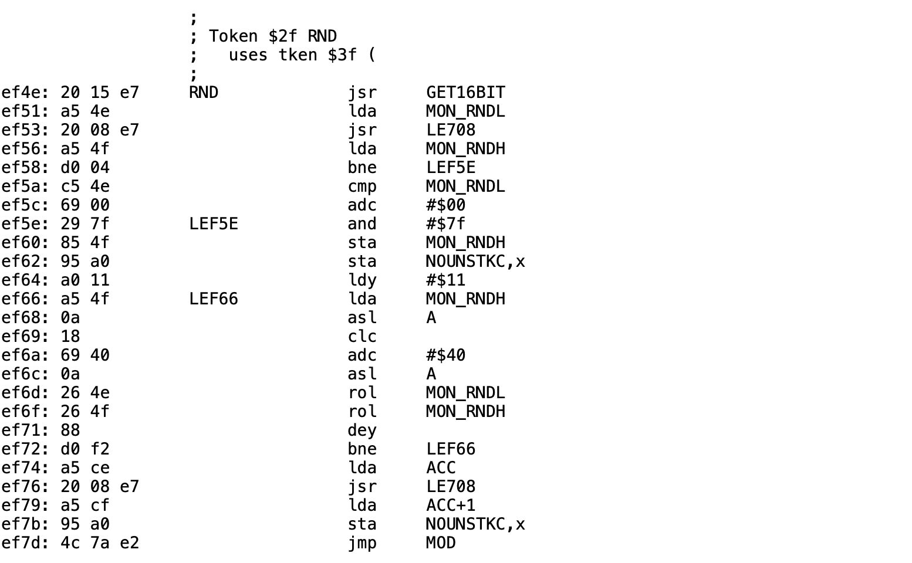
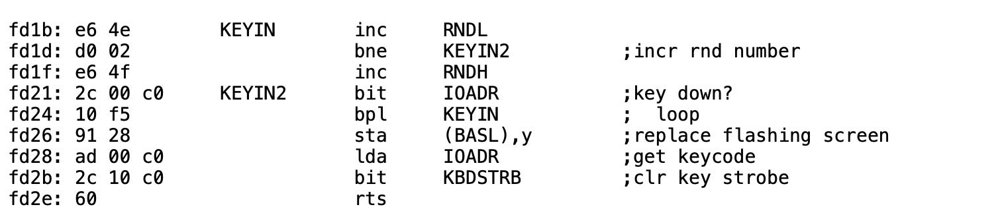
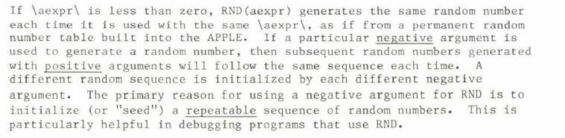

# Keynote outline: Applesoft's Loaded Dice (expanded edition)

One section per slide: on-screen content, speaker notes, and the assets it uses. Import the .pptx into Keynote for the laid-out version; use this file to rebuild by hand.
Slides 0-18 are the talk (about 35 min with both demos); A1-A5 are backup.

## 0 · Applesoft's Loaded Dice
*Layout:* title

The Truth About Randomness on the Apple II, Then and Now
Jeff Robison  ·  VCF Midwest 21  ·  2026

**Speaker notes.** Name and title, fifteen seconds. BEFORE this slide: power-cycle the machine (switch off, wait, on), PRINT RND(1), three times. Never Ctrl-RESET or PR#6 for the demo: they keep the fifth seed byte and the number changes. Rehearse on the machine you bring; its number may differ from .973136996, what matters is that it repeats.

## 1 · The Problem
*Layout:* hero

```
]PRINT RND(1)
.973136996
```

**Power off. Power on. Same number.**

<small>“exactly the same sequence each time the machine is powered on.”  — J. W. Aldridge, Behavior Research Methods, Instruments, & Computers 19(4), 1987</small>

**Speaker notes.** The number they just watched three times. Don't explain it yet. If someone's machine prints something else: one seed byte is never initialized, so the exact value can vary by machine, but it is the same on every power-on of that machine.

## 2 · Why nobody noticed
*Layout:* twocol


**Looks random**

- RUN it again: different numbers
- Ctrl-RESET, then RUN: different
- Reboot DOS: different

**Repeats**

- Power switch off, then on
- The first run of every day
- The one run nobody compares

<small>One seed byte survives everything except a power cycle. Aldridge (1987): repetition appears “only when a machine is powered off and back on.”</small>

**Speaker notes.** This is the most counterintuitive fact in the talk, and it explains why the bug survived. A programmer at a desk reruns and reboots all day and sees variety. The first user of the day gets the same sequence. Ctrl-RESET preserving the seed was confirmed by emulating the ][+ ROM; the reboot behavior is Aldridge's observation.

## 3 · Pseudo-random means repeatable
*Layout:* bullets

- A PRNG is a formula: same starting number in, same sequence out.
- Two separate questions. Where does the sequence start? That's the seed. Does the output show patterns? That's the generator.
- Entropy only answers the first question.
- This talk is mostly about the seed. The generator gets its turn on slide 9.

<small>“Good enough” depends on the job: a game shuffle, a psychology experiment and cryptography need different things.</small>

**Speaker notes.** Thirty seconds. The room knows what a PRNG is; this slide exists to separate seed from generator so nobody can say the talk confused them.

## 4 · Integer BASIC, 1977: Woz's RND at $EF4E
*Layout:* image · *Assets:* assets/deck_images/image2.png



- 15-bit shift register: one cycle of 32,767
- Its state IS $4E/$4F, the monitor's keyboard-wait counter
- RND(n) returns the register MOD n
- Whole RNG: 6 bytes in KEYIN + 50 in RND, hand-assembled

<small>Disassembly: Paul Santa-Maria, via Andy McFadden (6502disassembly.com). Period and feedback taps checked by emulating $EF4E–$EF72.</small>

**Speaker notes.** Speaker line: a 15-bit maximal shift register with a zero-lock guard, in 50 hand-assembled bytes, in an 8K ROM that couldn't fit the hi-res routines. Concede: every program walks the same 32,767-step cycle and MOD n is biased when n isn't a power of two. Good for games, not statistics. Don't make the regression argument yet.

## 5 · The entropy source: KEYIN at $FD1B
*Layout:* image · *Assets:* assets/deck_images/image1.png



- INC RNDL / INC RNDH on every pass while waiting for a key
- 15 CPU cycles per pass ≈ 68,000 counts a second
- The 16-bit counter wraps about once a second
- It moves only while KEYIN waits. Code that polls $C000 never stirs it.

<small>Not a jiffy clock: the Apple II has no timer. Monitor listing credits S. Wozniak and A. Baum (Apple II Reference Manual, 1978).</small>

**Speaker notes.** Point at the BNE back to KEYIN: that is the entire entropy source. It's a loop count, not a keystroke count. Human reaction-time jitter spans many wraps, which is why the value looks uniform. Same counter exists in the Autostart, IIe and IIc firmware; don't claim the IIgs.

## 6 · Applesoft II: the manual's promise
*Layout:* image · *Assets:* assets/deck_images/image8.png, assets/deck_images/image9.png




- RND(n): “a new random number each time it is used”
- RND(−n): a repeatable sequence, on purpose, for debugging
- Never mentioned: every power-on starts the same sequence

> **Repeatable on purpose: documented. Repeatable by accident: not.**

<small>Apple, Applesoft II BASIC Programming Reference Manual (scans from the presenter's deck; confirm edition before citing a year).</small>

**Speaker notes.** The promise before the reality. The manual tells you how to get the same sequence on purpose and never tells you you're getting it by accident. Aldridge's word in 1987: undocumented.

## 7 · Microsoft's RND at $EFAE
*Layout:* code

```asm
EFAE: 20 82 EB  RND  JSR SIGN        ; -1 / 0 / +1
EFB1: AA             TAX
EFB2: 30 18          BMI $EFCC       ; negative: reseed
EFB4: A9 C9          LDA #<RNDSEED
EFB6: A0 00          LDY #>RNDSEED
EFB8: 20 F9 EA       JSR LOAD_FAC    ; FAC = seed
EFBB: 8A             TXA
EFBC: F0 E7          BEQ $EFA5 (RTS) ; RND(0): old value
EFBE: A9 A6          LDA #<CON_RND_1
EFC0: A0 EF          LDY #>CON_RND_1
EFC2: 20 7F E9       JSR FMULT       ; x 11879546.40625
EFC5: A9 AA          LDA #<CON_RND_2
EFC7: A0 EF          LDY #>CON_RND_2
EFC9: 20 BE E7       JSR FADD        ; + 3.93e-8
```
- Microsoft's 6502 BASIC, licensed by Apple, shipped unchanged
- Seed at $C9–$CD. Only RND reads or writes it.
- $4E/$4F still counts under Applesoft. RND never reads it.
- The add is lost to precision: it changed 5 of 57,021 steps

<small>Bytes checked against the ][+ ROM image. Labels after S-C DocuMentor (Sander-Cederlof) via McFadden. Full 28-instruction listing: backup slide A1.</small>

**Speaker notes.** Twenty-eight instructions in all; this shows the first fourteen, the swap-and-normalize half is on backup A1. Point at the top: the seed comes from $C9. The answer goes back to $C9. Nothing else feeds it. The famous comments ('very poor RND algorithm') are Sander-Cederlof's, not Microsoft's.

## 8 · The seed copy is off by one
*Layout:* table

*F150: A2 1C   LDX #$1C  copies 4 of the 5 seed bytes. $CD keeps whatever RAM held.*

| $CD at power-on | First PRINT RND(1) |
|---|---|
| $FF or $FE | .973136996 |
| $00 | .270011996 |
| $58 (the byte ROM meant to copy) | .512199496 |
| $AA | .738761996 |

<small>256 possible $CD values give 181 different first numbers. Emulated on the ][+ ROM (SHA-1 33a24f54…). Fix published in AAL, May 1984: $F151 from $1C to $1D.</small>

**Speaker notes.** This is why the audience's own machine may print a different number, and why only a power cycle repeats. The bug is in Microsoft's source (LDXI RNDX+4-CHRGET), and Steil reports it in every Microsoft 6502 BASIC. Apple edited this very loop (it inserted STX SPEEDZ) and kept the short count.

## 9 · The generator falls into short loops
*Layout:* chart

*Every cold start ends in one of five loops. The seed has about 4 billion possible values.*

| Loop length (calls) | Share of $CD values |
|---|---|
| 37,758 | 43.0% |
| 32,366 | 30.5% |
| 202 | 23.0% |
| 4,082 | 2.0% |
| 12,559 | 1.6% |

<small>Share of the 256 possible $CD values that end in each loop (loop length in calls)</small>

<small>Kaner & Vokey saw 202; Sander-Cederlof saw 37,758. Same generator, different uncopied byte. Exhaustive emulated sweep of $CD; other reseeds may reach other loops.</small>

**Speaker notes.** The two published periods don't disagree; they're two of the five loops. Almost a quarter of possible power-on bytes put an untouched program into a loop of 202 numbers. A better seed doesn't escape this: RND(-52894) and RND(-22258) also land in the 202 loop.

## 10 · Who got hurt
*Layout:* quote

> …the subjects receiving the repeated lists were those tested at the beginning of each day, immediately after the computer had been turned on.

— J. W. Aldridge, “Cautions regarding random number generation on the Apple II,” Behavior Research Methods, Instruments, & Computers 19(4):397–399, 1987

<small>A memory experiment meant to give every subject an individually randomized word list.</small>

**Speaker notes.** This is the stakes. Not a game with a predictable shuffle, which we'd be guessing at, but a published experiment. Kaner and Vokey were writing for the same reason: every experiment they ran needed randomized order.

## 11 · A regression of the default, not the capability
*Layout:* table

|   | Integer BASIC (1977) | Applesoft II (1978–) |
|---|---|---|
| Generator | 15-bit shift register | Microsoft floating-point multiply, swap, normalize |
| State | 15 bits | 5-byte float (32-bit mantissa) |
| Cycle | 32,767, one cycle | Loops of 202 to 37,758 |
| Power-on seed | Whatever $4E/$4F holds | 4 ROM bytes + 1 leftover byte |
| Keyboard timing | Used automatically | Only if the program asks |
| Weakness | Tiny state, MOD bias | Short loops, fixed start |

<small>Both generators are weak. Only one threw away the seed the machine was already collecting.</small>

**Speaker notes.** This is where the talk survives 'both are bad'. Concede the Integer BASIC weaknesses openly. The claim is narrow: Integer BASIC gave you keystroke timing by default because the counter and the generator state are the same bytes; Applesoft kept the counter running and ignored it.

## 12 · Why 1978 got worse
*Layout:* bullets

- Microsoft's source had two RNDs: the Commodore build read hardware timers; every other target got a fixed seed.
- Apple got the fixed-seed build.
- Apple edited the seed-copy loop itself (it inserted STX SPEEDZ) and kept the short count.
- RND, its constants and that loop are byte-identical in the ][+, IIe and enhanced IIe ROMs.

<small>No record says why. Say “nobody connected it,” not “nobody knew.” Sources: Microsoft BASIC-M6502 source (2025 release); AppleWin ROM images compared byte-wise.</small>

**Speaker notes.** Portability doesn't hold up as a reason: Microsoft's file already had Apple-only code, and Commodore got a machine-specific RND in the same file. Motive is inference; label it that way on stage.

## 13 · “Just seed it first.”
*Layout:* twocol


**New code**

- X = RND(-(PEEK(78)+256*PEEK(79)))
- Apple's own advice to Aldridge's lab
- Only works after a keypress
- Both bytes 0 means RND(0): no reseed

**Existing code**

- Thousands of programs never did it
- You can't edit software you didn't write
- The failure is silent
- The machine used to do it for you

<small>Agree with the heckle for new code. The patch is for everything already written.</small>

**Speaker notes.** Say this before anyone in the room does. The zero case is a genuine edge: SIGN reduces 0 to the RND(0) path, which returns the old value and never reseeds.

## 14 · The fix: put the counter back
*Layout:* table

*Part 1, LC_Loader.bin copies ROM into language-card RAM. Part 2, Patch_lc.bin is the new RND front end.*

| Address | In ROM | In the language-card copy |
|---|---|---|
| $D000–$EFAD | Applesoft | copied |
| $EFAE | RND: JSR SIGN | JMP $F5CB |
| $EFB1–$F5CA | Applesoft | copied |
| $F5CB–$F5FF | HFIND (53 bytes, no Applesoft caller) | patch code |
| $F600 | RTS shared with HLIN | must stay RTS |
| $F601–$FFFF | DRAW … Monitor | copied |

<small>Checked on the ][+ ROM: no JSR or JMP targets $F5CB; the branch at $F59C lands on the RTS at $F600. RND(−n) and RND(0) keep their documented behavior.</small>

**Speaker notes.** Presenter to confirm: exact patch length (at most 53 bytes); exactly what positive RND does with the counter (every call, once, or when it changed); that HPLOT TO, DRAW and XDRAW still work after install.

## 15 · Limits, and what to test before release
*Layout:* bullets

- Fixes the seed, not the generator: the 202-number loop is still reachable.
- Needs a keypress first: a turnkey HELLO that calls RND immediately gets leftover counter bits.
- Needs a language card, and shares it: test under DOS 3.3 with INT/FP, and under ProDOS.
- Test what Ctrl-RESET does to the patch on a IIe and a IIc.
- A tight loop with no keypress must not repeat values.

<small>Compatibility matrix and test scripts: 03_Collateral/HARDWARE_TEST_PLAN.md. Mark each cell tested, emulated, or untested.</small>

**Speaker notes.** Scope, stated plainly, is a strength: Kaner & Vokey, Call-A.P.P.L.E., Sander-Cederlof and Moore all replaced the generator. This patch deliberately doesn't, so RND(-n) keeps repeating and no program changes.

## 16 · Proof
*Layout:* hero

```
power on  →  BRUN LC_LOADER
]PRINT RND(1)
power off, on, again  →  a different number
```

**Close the loop the opening demo opened.**

<small>If power-cycling on stage is risky, show a recorded clip. About 90 seconds.</small>

**Speaker notes.** Symmetry is the cheapest persuasion available: the talk opened with proof of the problem, so close with proof of the fix.

## 17 · Now
*Layout:* bullets

- Debian OpenSSL, 2006–2008 (CVE-2008-0166): a code change removed nearly all entropy input. Keys still looked random, for about two years.
- C's rand() without srand() behaves as if seeded with 1: the same sequence every run, today.
- Same shape as 1978: the output looks fine; the seed quietly stopped being random.

<small>A parallel, not a lineage. Nobody learned this from the Apple II, and nobody ignored it either.</small>

**Speaker notes.** Thirty seconds. This delivers the 'and Now' in the subtitle without overclaiming.

## 18 · Take home
*Layout:* takeaways

- 1977: Integer BASIC's RND was seeded by you.
- 1978: Applesoft's RND was seeded by ROM, and the counter went unread.
- It hid for years: rerun looked random; only power-on repeated.

**Try it yourself:  [ presenter: link text + QR code ]**

**Speaker notes.** Three lines, then the link. Put the URL on screen as text, not only as a QR.

## 19 · A1 · Backup: RND, all 28 instructions
*Layout:* code2

```asm
EFAE: 20 82 EB  RND  JSR SIGN        ; -1 / 0 / +1
EFB1: AA             TAX
EFB2: 30 18          BMI $EFCC       ; negative: reseed
EFB4: A9 C9          LDA #<RNDSEED
EFB6: A0 00          LDY #>RNDSEED
EFB8: 20 F9 EA       JSR LOAD_FAC    ; FAC = seed
EFBB: 8A             TXA
EFBC: F0 E7          BEQ $EFA5 (RTS) ; RND(0): old value
EFBE: A9 A6          LDA #<CON_RND_1
EFC0: A0 EF          LDY #>CON_RND_1
EFC2: 20 7F E9       JSR FMULT       ; x 11879546.40625
EFC5: A9 AA          LDA #<CON_RND_2
EFC7: A0 EF          LDY #>CON_RND_2
EFC9: 20 BE E7       JSR FADD        ; + 3.93e-8
EFCC: A6 A1          LDX FAC+4       ; swap lowest and
EFCE: A5 9E          LDA FAC+1       ;   highest mantissa
EFD0: 85 A1          STA FAC+4       ;   bytes
EFD2: 86 9E          STX FAC+1
EFD4: A9 00          LDA #0
EFD6: 85 A2          STA FAC_SIGN    ; force positive
EFD8: A5 9D          LDA FAC
EFDA: 85 AC          STA FAC_EXT     ; exponent -> guard
EFDC: A9 80          LDA #$80
EFDE: 85 9D          STA FAC         ; value < 1
EFE0: 20 2E E8       JSR NORMALIZE
EFE3: A2 C9          LDX #<RNDSEED
EFE5: A0 00          LDY #>RNDSEED
EFE7: 4C 2B EB       JMP STORE_FAC   ; round, save seed
```

<small>Bytes match the AppleWin Apple2_Plus.rom image; identical in the IIe and enhanced IIe images. Labels after S-C DocuMentor.</small>

**Speaker notes.** For the person who asks to see every byte.

## 20 · A2 · Backup: the constants as actually read
*Layout:* table

*Each constant is 4 bytes in ROM, but the float loader always reads 5.*

| Constant | Bytes read | Value |
|---|---|---|
| Multiplier ($EFA6) | 98 35 44 7A + 68 | 11,879,546.40625 |
| Addend ($EFAA) | 68 28 B1 46 + 20 | 3.92767778 × 10⁻⁸ |
| Seed table ($F123) | 80 4F C7 52 58 | ≈ 0.811635157 (last byte never copied) |
| RND(−1) seed | — | 2.99196472E-08 |

<small>Truncated constants are in Microsoft's own source (octal, RADIX 8). The stray 5th bytes are the next constant and the JSR opcode of RND.</small>

**Speaker notes.** Sander-Cederlof: 'THESE ARE MISSING ONE BYTE FOR FP VALUES'.

## 21 · A3 · Backup: every cold start, all 256 $CD values
*Layout:* table

| Loop length | $CD values | Share | Where it's been seen |
|---|---|---|---|
| 37,758 | 110 | 43.0% | Sander-Cederlof, AAL 1984; $CD=$FF, $00 |
| 32,366 | 78 | 30.5% | RND(-2), RND(-54321) |
| 202 | 59 | 23.0% | Kaner & Vokey 1984; $CD=$58, $7A |
| 4,082 | 5 | 2.0% | RND(-25284) |
| 12,559 | 4 | 1.6% | $CD=$5F, $6D, $A8, $A9 |

<small>Emulated with py65 on the real ROM routine. Harness sets FAC and seed only; no hardware run. Raw rows: 04_Research_and_Evidence/tools/cd_sweep_results.jsonl.</small>

**Speaker notes.** If challenged on method: the tools are in the handout folder and re-run in about ten seconds per start.

## 22 · A4 · Backup: open items before the show
*Layout:* table

| Question | Why it matters | Status |
|---|---|---|
| What $CD holds at power-on on the demo machine | Decides the number on screen | untested |
| Patch length ≤ 53 bytes; HPLOT TO / DRAW work | HFIND budget | untested |
| Positive RND in a tight loop, no keypress | Could repeat values | untested |
| RND(−1) + five RND(1), with and without GET | Documented contract | untested |
| DOS 3.3 INT/FP, ProDOS, Ctrl-RESET on IIe/IIc | Language-card conflicts | untested |
| //c and IIgs Applesoft bytes | “All Apple II” claims | not checked |

<small>Hide or delete this slide before presenting.</small>

**Speaker notes.** Working slide for the presenter, not the audience.

## 23 · A5 · Sources
*Layout:* bullets

- Kaner & Vokey, “A Better Random Number Generator for Apple's Floating Point BASIC,” MICRO, June 1984 (ms. 1982)
- “RND is Fatally Flawed,” Call-A.P.P.L.E., Jan 1983, pp. 29–34
- B. Sander-Cederlof, “Random Numbers for Applesoft,” Apple Assembly Line, May 1984; S-C DocuMentor
- J. W. Aldridge, Behavior Research Methods, Instruments, & Computers 19(4):397–399, 1987
- J. M. Gleason, Collegiate Microcomputer 6(2):108–112, 1988 (ERIC EJ372427)
- Microsoft, BASIC-M6502 source, github.com/microsoft/BASIC-M6502
- A. McFadden, 6502disassembly.com (Applesoft, Integer BASIC, monitor ROMs)
- M. Steil, pagetable.com; D. Empson, GS WorldView, Nov 1999

<small>Full annotated bibliography: 03_Collateral/SOURCES.md</small>
