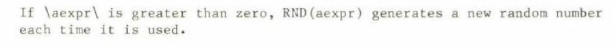
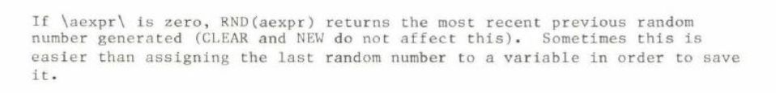
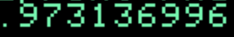
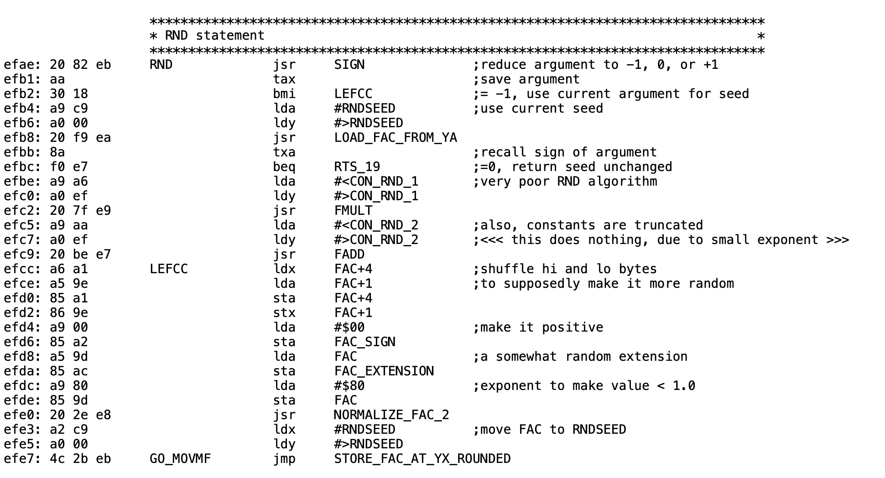

<!-- badge: 0 -->
<!-- _class: main -->
# Applesoft's Loaded Dice
The Truth About Randomness on the Apple II, Then and Now

Jeff Robison   ·   VCF Midwest 21 2026


<!--
Name and title. Fifteen seconds.

Before this slide: power-cycle the machine (switch off, wait, on) and PRINT RND(1). Three times. Not Ctrl-Reset, not PR#6: a warm restart keeps the fifth seed byte in RAM and prints a different number.

Applesoft is Microsoft's 6502 BASIC, licensed by Apple. That matters in a few slides.
-->

---

<!-- badge: 1 -->
<!-- _footer: "Aldridge, Behavior Research Methods, Instruments, & Computers 19(4):397–399, 1987" -->
<!-- _class: main -->
# The Problem
`]PRINT RND(1)`

`.973136996`

Power off. Power on. Same number.

“…exactly the same sequence each time the machine is powered on.”


<!--
The number they just watched three times. Don't explain it yet: "Hold onto that number."

If someone says their machine prints a different number: one seed byte is never set. $FF or $FE gives .973136996, $00 gives .270011996. Each machine still repeats its own number. We'll get to exactly why.
-->

---

<!-- badge: 2 -->
<!-- _footer: "Aldridge 1987; Ctrl-Reset behavior measured on the II Plus ROM warm-start path" -->
<!-- _class: main -->
# Why nobody noticed
Everything a programmer does at a desk looks random.

**RUN it again:** Different numbers. / The seed carries on from the last call.

**Reboot DOS, Ctrl-Reset:** Different numbers. / The seed survives in RAM.

**Power switch:** The same sequence. / The first user of the day sees it.


<!--
This is why it survived for years. The programmer at the desk reruns, reboots DOS, hits Reset: all different. Only the first user of the day, after a cold power-on, gets the repeat.

Aldridge: "It is only when a machine is powered off and back on that the sequence begins repeating itself."

Ctrl-Reset leaves $C9-$CD untouched (measured by running the ROM's warm-start path).
-->

---

<!-- badge: 3 -->
<!-- _class: main -->
# Pseudo-random means repeatable
**The seed:** Where the sequence starts. / Needs entropy: something you can’t predict.

**The generator:** What the sequence looks like. / Needs a long period and no visible pattern.

> Same seed → same numbers. Every time. This talk is about the seed.


<!--
Thirty seconds. This room knows what a PRNG is.

The split matters for the rest of the talk and for Q&A: a random seed doesn't make a generator's output patternless, and a good generator doesn't help if it always starts in the same place. This talk is about the seed. The generator is weak too, and we'll say so honestly.
-->

---

<!-- badge: 4 -->
<!-- _footer: "Integer BASIC disassembly (Santa-Maria, via McFadden); Sander-Cederlof, AAL Aug 1981; Wozniak, BYTE May 1977; period measured by emulation" -->
<!-- _class: main -->
# Integer BASIC, 1977: seeded by you
Woz’s generator at $EF4E, hand-assembled.

**The generator:** 15-bit shift register / Repeats every 32,767 calls / RND(X) = state MOD X / 50 bytes

**The seed:** $4E/$4F counts while the monitor waits for a key / That counter is the generator’s state / Every key wait stirs it / 6 bytes, in KEYIN

> Good enough for games, its stated purpose. Not for statistics.


<!--
Say out loud that $4E/$4F is not a jiffy clock. The Apple II has no timer doing this.

Not a toy: a 15-bit maximal shift register in 50 hand-assembled bytes. Woz wrote Integer BASIC with no assembler; there is no source file, only hand-written pages.

The counter isn't just read as a seed. It IS the generator's state: RND scrambles $4E/$4F and writes it back, so every key wait stirs it.

Don't make the regression argument yet. Just show what worked.
-->

---

<!-- badge: 5 -->
<!-- _footer: "6502disassembly.com: OrigF8ROM, AutoF8ROM, Unenh_IIe_80col, IIc_16kb; Apple II Reference Manual p. 32" -->
<!-- _class: main -->
# The entropy source is a busy-wait

Not a timer. Not a jiffy clock. A loop count.

**Rate:** 15 CPU cycles per pass / ≈ 68,000 counts a second / Wraps ≈ once a second

**Same counter in:** Autostart F8 ($FD1B) / IIe 80-col ($CB15) / IIc ($CC71)

**Only moves:** while a KEYIN-style routine waits for a key

_Monitor KEYIN, $FD1B. Listing credited to S. Wozniak and A. Baum._


<!--
Point at the bne back to KEYIN. That's the whole entropy source.

The counter is bumped before the keyboard is read, every pass. A loop count, not a keystroke count. 15 CPU cycles per pass: about 68,000 counts a second, wrapping roughly once a second. Human reaction time jitters by far more than a second's worth of counts, which is why it works.

Same counter in the Autostart ROM, the IIe and the IIc. Say that in one line.

Caveat if asked: it only moves while a KEYIN-style routine waits. A game polling $C000 never moves it.
-->

---

<!-- badge: 6 -->
<!-- _footer: "Applesoft II BASIC Programming Reference Manual, Apple Computer (printing to confirm)" -->
<!-- _class: main -->
# What the manual promised




- RND(n) (manual scan)

- RND(−n) (manual scan)

- RND(0) (manual scan)

- …starting here, every power-on.

- Repeatable on purpose: documented.

- Repeatable by accident: not.


<!--
The promise before the reality.

Read the RND(n) line aloud: "generates a new random number each time it is used." True. It never says the sequence starts in the same place every power-on.

RND(-n): Apple documents repeatability as a feature, for debugging.

The manual tells you how to get the same sequence on purpose. It never tells you you're getting it by accident.

[Jeff: confirm which printing these scans come from.]
-->

---

<!-- badge: 7 -->
<!-- _footer: "Microsoft BASIC M6502 v1.1 source, github.com/microsoft/BASIC-M6502; 6502disassembly.com/a2-rom/Applesoft.html" -->
<!-- _class: main -->
# Applesoft II: Microsoft's RND

Microsoft wrote it. Apple shipped it unchanged through the enhanced IIe.

**Seed at $C9:** Filled from ROM at power-on. / Nothing outside RND touches it.

**$4E/$4F:** Still counts. / Applesoft never reads it.

_II Plus ROM. Comments: Bob Sander-Cederlof (S-C DocuMentor), via Andy McFadden. Not Microsoft’s._


<!--
The reveal. Twenty-eight instructions. Microsoft wrote it; Apple shipped it unchanged in every Applesoft ROM through the enhanced IIe.

Top: the seed comes from $C9. Bottom: the answer goes back to $C9. Nothing else feeds it.

The comments on this listing are Bob Sander-Cederlof's annotations, not Microsoft's. Say so before someone else does.

The add is lost to precision: running the ROM, it changed the stored seed in 5 of 57,021 steps. "Effectively nothing."
-->

---

<!-- badge: 8 -->
<!-- _footer: "II Plus ROM bytes; S-C DocuMentor; Sander-Cederlof, AAL May 1984; values from running the ROM code" -->
<!-- _class: main -->
# One byte short
## Cold start copies 4 of the 5 seed bytes. The fifth, $CD, is whatever RAM held.
```
F123: 80 4F C7 52 58   seed table

F150: A2 1C      LDX #$1C     ; one short
F152: BD 0A F1   LDA $F10A,X
F155: 95 B0      STA $B0,X
F157: 86 F1      STX SPEEDZ   ; Apple’s
F159: CA         DEX
F15A: D0 F6      BNE $F152
```
| $CD at power-on | First RND(1) |
|---|---|
| $FE or $FF | .973136996 |
| $00 | .270011996 |
| $58 (intended) | .512199496 |
| $AA | .738761996 |

> 256 possible bytes → 181 different first numbers. Each machine still repeats its own.

<!--
The most interesting detail in the story, and it explains why your number might differ from mine.

The copy loop moves CHRGET and the seed into zero page. The count is one too small. Four seed bytes arrive; the fifth, $CD, is whatever RAM held.

The bug is in Microsoft's source. But look at $F157: STX SPEEDZ is Apple's own instruction, for SPEED=, inserted inside this loop. Apple's engineers worked inside this loop and kept the short count.

Sander-Cederlof published the one-byte fix in 1984: $F151 from $1C to $1D.

$CD at power-on on real DRAM is not published anywhere. [Jeff: measure on the demo machine; backup B3.]
-->

---

<!-- badge: 9 -->
<!-- _footer: "Kaner & Vokey, MICRO June 1984; Sander-Cederlof, AAL May 1984; all 256 cold starts run on the II Plus ROM" -->
<!-- _class: main -->
# Two published loops, one generator
- Kaner & Vokey saw a loop of 202. Sander-Cederlof saw 37,758. Both were right.

**$CD = $FF:** 37,758-number loop / after 6,818 calls

**$CD = $58, the intended byte:** 202-number loop / after 15,382 calls

**Reseeding:** RND(−52894) lands in the 202 loop too

- Where all 256 possible cold starts end up, by loop length

- 37,758-number loop: 110 of 256 (43.0%)

- 32,366-number loop: 78 of 256 (30.5%)

- 202-number loop: 59 of 256 (23.0%)

- 4,082-number loop: 5 of 256 (2.0%)

- 12,559-number loop: 4 of 256 (1.6%)


<!--
Kaner and Vokey saw a 202-number loop. Sander-Cederlof saw repetition at 37,758. Both were right.

Running every possible value of the uncopied byte: nearly a quarter of cold starts end up in the 202-number loop. Microsoft's intended byte, $58, is one of them.

Reseeding doesn't escape it: RND(-52894) and RND(-22258) both land in the 202 loop. Keep that for the question "does the patch fix the loop?" (No.)

The four 12,559 results weren't checked to be one loop. Don't dwell on that bar.
-->

---

<!-- badge: 10 -->
<!-- _class: main -->
# A regression of the default
## Both generators are weak. Only one seeded itself.
|   | Integer BASIC (1977) | Applesoft II (Microsoft) |
|---|---|---|
| State | 15 bits at $4E/$4F | 5-byte float at $C9–$CD |
| Loop length | 32,767, one cycle | 202 to 37,758, depends on seed |
| Seed by default | Keypress timing, automatically | ROM, plus one leftover byte |
| Reads $4E/$4F | It is $4E/$4F | Never |
| Programmer must | Nothing | RND(−(PEEK(78)+256*PEEK(79))) |

> The machine didn’t lose its entropy source in 1978. The default stopped using it.

<!--
The strongest honest version of the thesis. Concede that both generators are weak.

Integer BASIC: one 32,767-long cycle; a seed only picks a position. State MOD X. Weak.
Applesoft: bigger state, short loops. Also weak.

The difference that matters is the default. Integer BASIC got keypress timing automatically, because its state and the counter are the same bytes. Applesoft kept the counter running and ignored it.
-->

---

<!-- badge: 11 -->
<!-- _footer: "Microsoft m6502.asm (IFE REALIO-3); Steil, msbasic; ROM comparison of II Plus, IIe, enhanced IIe; Weyhrich, Apple II History ch. 16" -->
<!-- _class: main -->
# Why 1978 got worse
- Microsoft’s BASIC had two RNDs: timer-seeded for Commodore, a fixed seed for everyone else.

- Apple got the everyone-else build.

- Apple edited code inside the seed-copy loop (STX SPEEDZ at $F157) and kept the short count.

- The same RND bytes shipped in the II Plus, IIe and enhanced IIe ROMs.

> No record explains why. Nobody connected the counter the monitor was already running.


<!--
No record explains the decision. Every statement about motive is inference.

What is documented: Microsoft's source builds RND two ways. REALIO=3, the Commodore PET, reads free-running VIA timers in RND(0). Everyone else, including Apple, gets the fixed-seed version.

Apple wasn't locked out. Applesoft II's cold start has Apple's own insertions: SPEED=, TRACE, the silent RAM probe. STX SPEEDZ sits inside the seed-copy loop.

Say "nobody connected it", not "nobody knew" or "Microsoft was careless".
-->

---

<!-- badge: 12 -->
<!-- _footer: "Aldridge, Behavior Research Methods, Instruments, & Computers 19(4):397–399, 1987" -->
<!-- _class: main -->
# The damage
“…the subjects receiving the repeated lists were those tested at the beginning of each day, immediately after the computer had been turned on.”

Aldridge, 1987: a memory experiment with “individually randomized” word lists

Kaner & Vokey needed RND to randomize experiments too.

Published research ran on this generator.


<!--
This is the stakes. Thirty seconds, and read it slowly.

A psychology lab ran a memory experiment in which every subject was supposed to get an individually randomized word list. The same ordering kept reappearing, and it was always the first subject of the day, right after the computer was switched on.

Kaner and Vokey were writing because their experiments needed randomization too.

Don't name a game that shipped broken unless you have evidence for it. We don't.
-->

---

<!-- badge: 13 -->
<!-- _class: main -->
# Found, reported, worked around
| Year | Who | What |
|---|---|---|
| 1982/84 | Kaner & Vokey, MICRO | Loop of 202 numbers; replacement generator |
| 1983 | Call-A.P.P.L.E. | “RND is Fatally Flawed,” pp. 29–34 |
| 1984 | Sander-Cederlof, AAL | Seed copies 4 of 5 bytes; repetition at 37,758 |
| 1987 | Aldridge, BRMIC | Same word lists every morning; Apple’s advice: seed from $4E/$4F |
| 1988 | Gleason, Collegiate Micro. | Statistical tests; suggested seeds |
| 1989/99 | Moore; Empson | Shift-register replacement seeded from $4E/$4F |

> Found in 1982. Worked around, one program at a time. Never fixed in ROM.

<!--
Four decades of people finding the same thing and working around it one program at a time.

Kaner sent you the paper directly; say that aloud.

Call-A.P.P.L.E.'s author is sometimes given as D. Sparks. That's unverified, so it isn't on the slide.

Gleason: only the abstract has been read. Don't quote numbers from it.
-->

---

<!-- badge: 14 -->
<!-- _footer: "Aldridge 1987 (Apple’s advice to the lab)" -->
<!-- _class: main -->
# “Just seed it first”
Right. That’s what Apple told Aldridge’s lab in 1987.

**New code:** X = RND(−(PEEK(78)+256*PEEK(79))) / after a key wait, before the first RND

**Existing code:** You can’t edit software you didn’t write. / The failure is silent: only people who already know can fix it. / This machine used to do it automatically.

> The patch is for the programs nobody will ever edit.


<!--
Say it yourself before they do, and agree with it for new code.

Then the three-part answer. You can't edit software you didn't write. The failure is silent, so only people who already know can fix it. And this machine used to do it automatically.

Edge case if asked: if both counter bytes are zero, RND(0) doesn't reseed. One in 65,536.
-->

---

<!-- badge: 15 -->
<!-- _footer: "Jeff Robison, LC_Loader / Patch_lc; HFIND per S-C DocuMentor; byte search of the II Plus ROM" -->
<!-- _class: main -->
# The fix: put the counter back
- Copy the ROM into the language card, patch the copy, read from the card.

**Loader steps:** 1. Write-enable the LC, ROM still readable / 2. Copy $D000–$FFFF into the LC / 3. Write the patch at $F5CB / 4. Write JMP $F5CB at $EFAE / 5. Switch the LC to read

- $F800–$FFFF  Monitor, copied

- $F601  DRAW, untouched

- $F600  RTS shared with HLIN, untouched

- $F5CB–$F5FF  Patch code over HFIND: 53 bytes, never called by Applesoft

- $EFAE  RND entry: JMP $F5CB

- $D000–$F7FF  Applesoft, copied


<!--
Copy the whole ROM into the language card, patch the copy, and read from the card from then on. RND's entry jumps to patch code that lives where HFIND was.

HFIND: 53 bytes, $F5CB to $F5FF. The S-C DocuMentor marks it "not called by any Applesoft routine", and no JSR or JMP to $F5CB exists anywhere in the ROM.

$F600 is an RTS that HLIN branches to. The patch must stop at $F5FF, or HPLOT TO breaks.

[Jeff: state the patch's byte count here.]
-->

---

<!-- badge: 16 -->
<!-- _class: main -->
# What the fix does, and doesn’t
**Does:** Positive RND draws on the KEYIN counter / RND(−n) still repeats; RND(0) still replays / No program changes

**Doesn’t:** Fix the generator: the 202 loop is still there / Help before the first key wait / Work without a language card

> [Jeff: confirm behavior and compatibility (backup B4) before this slide is shown]


<!--
Scope stated before anyone asks.

It fixes the seed, not the generator. The 202 loop is still reachable. Replacing the generator would break the documented RND(-n) repeatability and there's no room.

It needs a key wait before the first RND to get any timing. Aldridge flagged the same limit for Apple's own advice.

[Jeff: fill in the exact behavior of positive RND, and the compatibility results from backup B4, before this slide goes on stage.]
-->

---

<!-- badge: 17 -->
<!-- _class: main -->
# Proof
`[power off, power on]`

`]BRUN LC_LOADER`

`]PRINT RND(1)`

`[power off, power on]`

`]BRUN LC_LOADER`

`]PRINT RND(1)`

Two power-ons. Two different numbers.

Live, or a recorded clip if power-cycling on stage is risky.


<!--
Symmetry with the opening: the talk opened with proof of the problem, so close with proof of the fix. About 90 seconds.

Power on, load the patch, PRINT RND(1). Power-cycle, load it again, PRINT RND(1). Different numbers.

Typing the BRUN command is itself a key wait, so the counter has moved.

If power-cycling on stage is risky, use a recorded clip. [Jeff: match the loader's file name.]
-->

---

<!-- badge: 18 -->
<!-- _footer: "Debian Security Advisory DSA-1571-1 (May 2008); ISO C, rand/srand" -->
<!-- _class: main -->
# Now: the same shape, 2006
A change silently disconnects the entropy. The output still looks random.

**Debian OpenSSL, 2006–2008:** A Debian change removed nearly all entropy from OpenSSL’s PRNG / Keys were predictable until May 2008 / CVE-2008-0166

**C, today:** rand() without srand() starts as if seeded with 1 / Same sequence, every run

> A parallel, not a lineage.


<!--
Present as a parallel, not a lineage. Nobody learned or failed to learn this from the Apple II.

Debian, September 2006: a change to OpenSSL's random number generator, made to silence a memory-checker warning, removed nearly all entropy mixing. Keys generated on Debian and Ubuntu were predictable until the May 2008 disclosure. CVE-2008-0166.

Same shape as 1978: the entropy input was silently disconnected, and the output still looked random.

Lighter version: C's rand() without srand() behaves as if seeded with 1. Same sequence, every run, today.
-->

---

<!-- badge: 19 -->
<!-- _class: main -->
# Try it yourself
- 1977: Integer BASIC seeded RND from you. Applesoft seeded it from ROM.

- It hid for years: rerun looked random; only power-on repeated.

- The fix puts the counter back without changing a single program.

- [ URL: Jeff to supply ]

- [ QR: Jeff to supply ]

- Jeff Robison   ·   VCF Midwest 21 2026


<!--
Takeaways first, then the link. Leave this up during questions.

Questions to expect are in QA_PREP.md: the different-number question, the C64, why not replace the generator, $F5CB, ProDOS, Ctrl-Reset, "does it fix the 202 loop?".
-->

---

<!-- badge: B1 -->
<!-- _footer: "AppleWin Apple2_Plus.rom (SHA-1 33a24f54…); S-C DocuMentor labels, simplified" -->
<!-- _class: backup -->
# Backup: Applesoft RND, byte by byte
```
EFAE: 20 82 EB  JSR SIGN        ; -1 / 0 / +1
EFB1: AA        TAX
EFB2: 30 18     BMI $EFCC       ; negative: reseed from arg
EFB4: A9 C9     LDA #$C9
EFB6: A0 00     LDY #$00
EFB8: 20 F9 EA  JSR LOAD_FAC    ; FAC = seed
EFBB: 8A        TXA
EFBC: F0 E7     BEQ $EFA5       ; RND(0): return seed
EFBE: A9 A6     LDA #$A6
EFC0: A0 EF     LDY #$EF
EFC2: 20 7F E9  JSR FMULT       ; x 11879546.40625
EFC5: A9 AA     LDA #$AA
EFC7: A0 EF     LDY #$EF
EFC9: 20 BE E7  JSR FADD        ; + 3.93E-8, lost
EFCC: A6 A1     LDX FAC+4       ; swap highest and
EFCE: A5 9E     LDA FAC+1       ;   lowest bytes
EFD0: 85 A1     STA FAC+4
EFD2: 86 9E     STX FAC+1
EFD4: A9 00     LDA #$00
EFD6: 85 A2     STA FAC_SIGN    ; force positive
EFD8: A5 9D     LDA FAC
EFDA: 85 AC     STA FAC_EXT     ; old exponent -> guard
EFDC: A9 80     LDA #$80
EFDE: 85 9D     STA FAC         ; value < 1
EFE0: 20 2E E8  JSR NORMALIZE
EFE3: A2 C9     LDX #$C9
EFE5: A0 00     LDY #$00
EFE7: 4C 2B EB  JMP STORE_FAC   ; round, write $C9-$CD
```
**Not a textbook LCG:** No modulus. · Float multiply, byte swap, renormalize. · LCG lattice theory doesn’t transfer.
**Measured:** Fraction bit 25 is set in 99.75% of outputs. · Leading digits pass uniformity and serial-pair χ².

<!--
For the hex-checkers. Every byte matches the AppleWin II Plus ROM, and the same bytes sit at the same addresses in the IIe and enhanced IIe ROMs.
-->

---

<!-- badge: B2 -->
<!-- _footer: "ROM bytes; Microsoft m6502.asm (octal); decoded with exact rational arithmetic; emulation of the II Plus ROM" -->
<!-- _class: backup -->
# Backup: the constants, as actually read
| Constant | Stored at | Bytes actually read | Value used |
|---|---|---|---|
| Multiplier | $EFA6 | 98 35 44 7A 68 | 11,879,546.40625 |
| Addend | $EFAA | 68 28 B1 46 20 | 3.93 × 10⁻⁸ |
| Seed | $F123 | 80 4F C7 52 (58 never copied) | ≈ .811635157 + leftover byte |

> The addend changed the stored seed in 5 of 57,021 steps. “Effectively nothing,” not “nothing.”

<!--
Each constant is stored as 4 bytes; the float loader always reads 5, so each picks up the next byte in ROM. The truncation is in Microsoft's own source (the RND constants were never widened for 5-byte floats).
-->

---

<!-- badge: B3 -->
<!-- _class: backup -->
# Backup: $CD on real hardware (to fill in)
| Machine / ROM | Boot path | PEEK(205) | First RND(1) |
|---|---|---|---|
| II Plus | No disk, Ctrl-Reset to ] |   |   |
| II Plus | DOS 3.3 |   |   |
| IIe (enhanced) | DOS 3.3 |   |   |
| IIe (enhanced) | ProDOS / BASIC.SYSTEM |   |   |
| IIc | ProDOS / BASIC.SYSTEM |   |   |

> Emulator reference:  $FF → .973136996   ·   $00 → .270011996   ·   $58 → .512199496

<!--
[Jeff: fill in before the show.] Power on, and before any RND: FOR I = 201 TO 205 : PRINT PEEK(I);" "; : NEXT, then PRINT RND(1).

Emulator reference: $FF or $FE gives .973136996, $00 gives .270011996, $58 gives .512199496.
-->

---

<!-- badge: B4 -->
<!-- _class: backup -->
# Backup: patch compatibility (to fill in)
| Configuration | Risk | Result |
|---|---|---|
| ProDOS 8 / BASIC.SYSTEM | ProDOS lives in LC RAM; loader overwrites it | untested |
| DOS 3.3, FP / INT | LC switches flip; patch may silently vanish | untested |
| Original II, Integer in ROM | Copies Integer BASIC, JMPs into its middle | untested |
| IIe / IIc, Ctrl-Reset | RESET forces ROM read; patch off | untested |
| Programs using the LC | Pascal, CP/M, RAM disks, /RAM | untested |
| //c ROMs, IIc Plus, IIgs | Applesoft bytes not checked | untested |

<!--
[Jeff: mark each cell tested on hardware, tested in an emulator (name it), or untested.] If the loader refuses a configuration, say so on slide 15.
-->

---

<!-- badge: B5 -->
<!-- _footer: "S-C DocuMentor; byte search and branch-target search of AppleWin Apple2_Plus.rom" -->
<!-- _class: backup -->
# Backup: HFIND and $F5CB
- HFIND runs $F5CB–$F5FF: 53 bytes. “Not called by any Applesoft routine” (S-C DocuMentor).

- No JSR or JMP to $F5CB anywhere in the II Plus ROM (byte search).

- $F600 is an RTS that HLIN reaches from BEQ at $F59C. Overwrite it and HPLOT TO breaks.

- DRAW starts at $F601.

- Residual risk: a program that does CALL 62923 itself.

- Regression test after patching: HPLOT … TO, DRAW, XDRAW, SCALE, ROT.


<!--
The answer to "what's at $F5CB?". Answer it straight.
-->

---

<!-- badge: B6 -->
<!-- _footer: "Microsoft m6502.asm (IFE REALIO-3, TIME==1); Steil, msbasic and c64ref" -->
<!-- _class: backup -->
# Backup: Commodore, same generator, different integration
**Same:** Microsoft’s generator and constants / Seed-copy bug in every Microsoft 6502 BASIC

**Different:** Microsoft’s Commodore build: RND(0) reads hardware timers (PET, 1977) / A TI clock variable / Idiom: `RND(−TI)

> Commodore got the platform integration from Microsoft. Apple did its own, and skipped RND.


<!--
The correction to "Commodore wired RND(0) to timers": the timer code is in Microsoft's own source for the Commodore target, and it shipped in the first PET ROM in 1977. Commodore carried it to the C64, where it goes through the KERNAL.
-->

---

<!-- badge: B7 -->
<!-- _class: backup -->
# Backup: sources
- Microsoft, BASIC M6502 8K v1.1 source, github.com/microsoft/BASIC-M6502 (2025)

- Sander-Cederlof, S-C DocuMentor: Applesoft; McFadden, 6502disassembly.com

- Kaner & Vokey, “A Better Random Number Generator for Apple’s Floating Point BASIC,” MICRO, June 1984

- Call-A.P.P.L.E., “RND is Fatally Flawed,” Jan 1983, pp. 29–34

- Sander-Cederlof, “Random Numbers for Applesoft,” Apple Assembly Line, May 1984

- Aldridge, “Cautions regarding random number generation on the Apple II,” BRMIC 19(4), 1987

- Gleason, Collegiate Microcomputer 6(2), 1988 (abstract read)

- Empson, GS WorldView, Nov 1999 (on Moore, 1989)

- Apple II Reference Manual (1978); Applesoft II BASIC Programming Reference Manual (1978)

- Steil, pagetable.com and msbasic; Weyhrich, Apple II History


<!--
Full list with read status in 03_collateral/SOURCES.md.
-->
